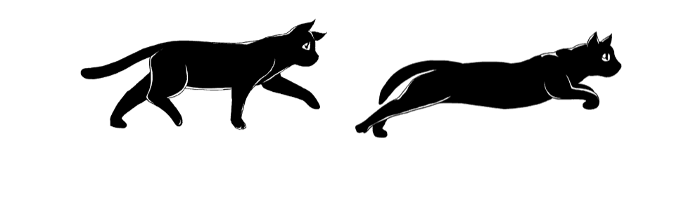

# Cat Walking 🐾

Este é um pequeno projeto de animação em HTML + CSS de um gatinho caminhando e pulando.

## Como usar

1. Clone o repositório:
    git clone https://github.com/IngridSlytherin/cat-walking.git

2. Abra o arquivo walking.html em um navegador.

## Demo

## Créditos

Animação criada por Ingrid Padilha.# Cat Walking
